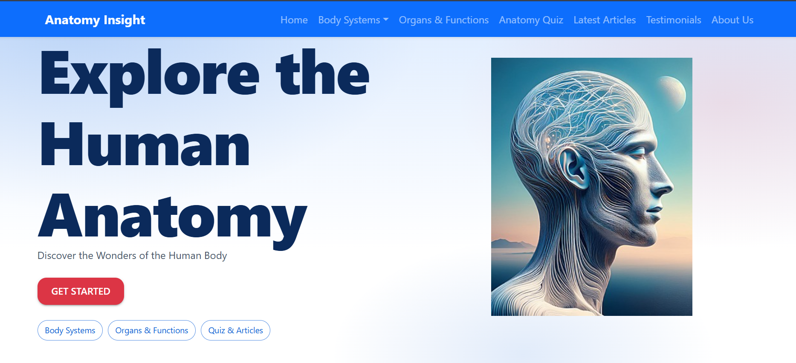

# Anatomy Insight

An interactive platform for exploring human anatomy. It provides detailed information about various body systems, organs, and functions with quizzes, 3D models, and educational articles.

## Table of Contents

- [Project Description](#project-description)
- [Installation Instructions](#installation-instructions)
- [Usage](#usage)
- [Screenshots](#screenshots)
- [Technologies Used](#technologies-used)
- [License](#license)

## Project Description

Anatomy Insight is a full-stack SPA (Single Page Application) web app designed to educate users about human anatomy. The platform includes:
- Interactive 3D models of human anatomy.
- Detailed explanations of body systems and organs.
- A quiz to test knowledge of human anatomy.
- Links to educational articles for deeper learning.

The app is built using **React**, **Material UI**, and **Bootstrap** to create an engaging and user-friendly experience for learning human anatomy.

## Installation Instructions

### Prerequisites

Before running the project, ensure that you have the following installed:
- **Node.js** (version 14 or higher)
- **npm** (Node Package Manager)

### Steps to Install

1. Clone the repository to your local machine:
   ```bash
   git clone https://github.com/your-username/your-repository.git
Navigate to the project directory:

bash
Copy code
cd your-repository
Install project dependencies:

bash
Copy code
npm install
Start the development server:

bash
Copy code
npm start
Open your browser and visit the app at http://localhost:3000.

Usage
Body Systems: Navigate through different body systems (e.g., Skeletal, Muscular, Nervous) and explore detailed information.

3D Anatomy Explorer: View and interact with 3D models of the human body. Rotate and zoom to see anatomical details.

Anatomy Quiz: Test your knowledge with an interactive quiz about human anatomy.

Latest Articles: Read articles on various topics related to human anatomy.

#Screenshots
Here are some screenshots of the Anatomy Insight platform:




I

#Technologies Used
Frontend:

React

Material UI (for UI components and styling)

Bootstrap (for grid and layout system)

React Router (for navigation)

Material UI Icons (for icons)

Backend:

Node.js (optional if you have quizzes or other data stored on the backend)

3D Viewer:

ModelViewer or Three.js (for interactive 3D anatomy models)

State Management:

React Hooks (useState, useMemo)

Deployment:

Deployed using Vercel or Netlify (or any other platform of your choice).

License
This project is licensed under the MIT License.

